# Controle Financeiro 💰📊

## About the project📜
Com o intuito de auxiliar consideravelmente pessoas a se organizarem melhor financeiramente, esse projeto foi desenvolvido para que, através de poucos cliques os usuários possam ter total noção sobre seu orçamento e sobre suas dividas relatadas, tendo um informe apropriado para que ela esteja ciente de seus gastos.

O projeto conta principalmente com um gráfico em que se é possível acompanhar suas dívidas/gastos e suas respectivas porcetagens em frente ao orçamento.

## Technologies used 💻⚙️
- Visual Studio Code
- JavaScript
- Bootstrap
- HTML

## Example of Project Operation

 
  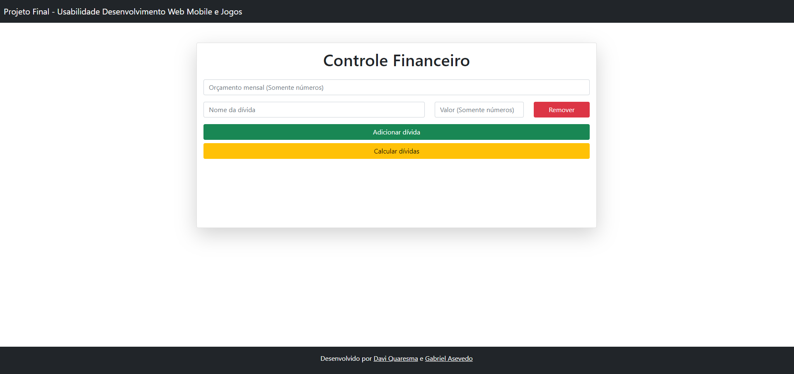
  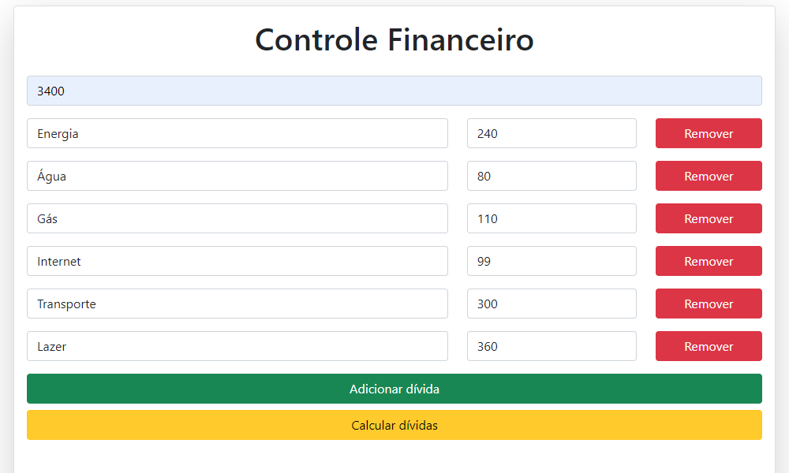
  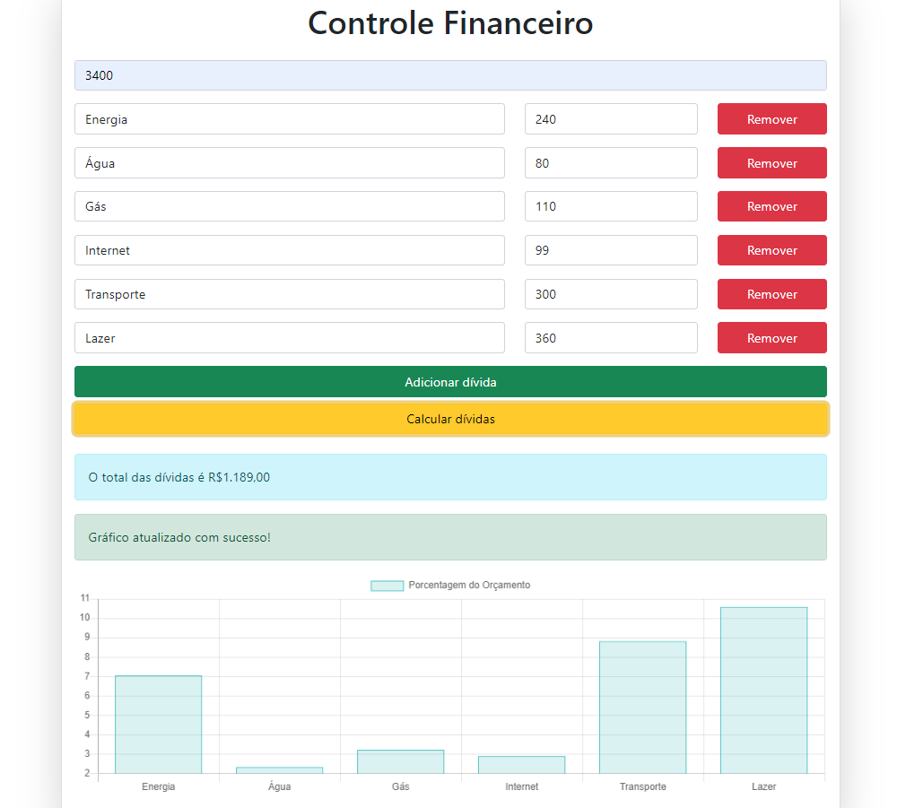
  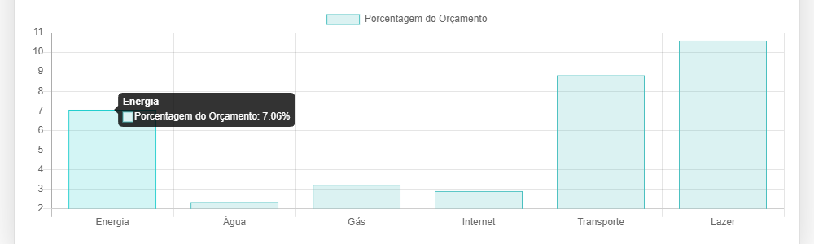
  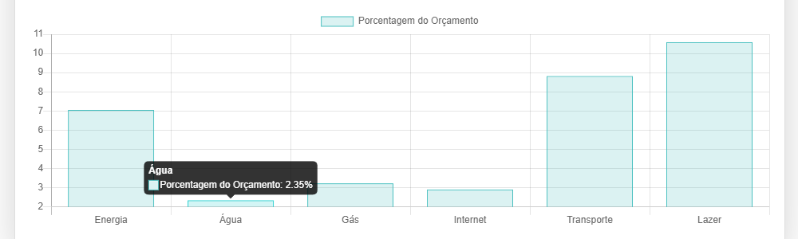
  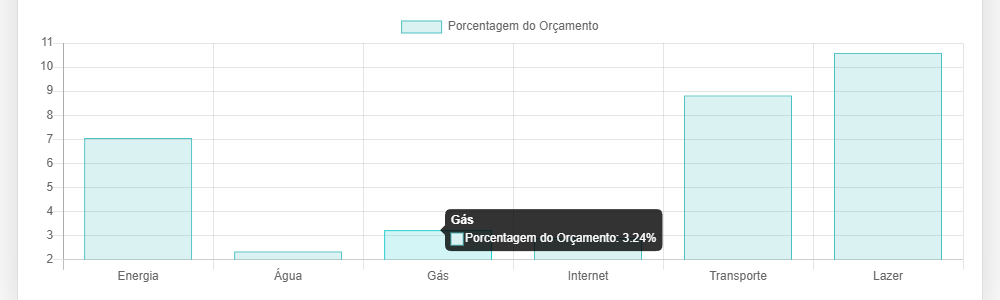
  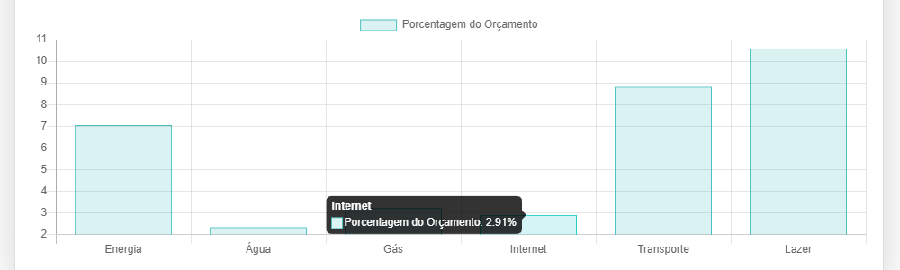
  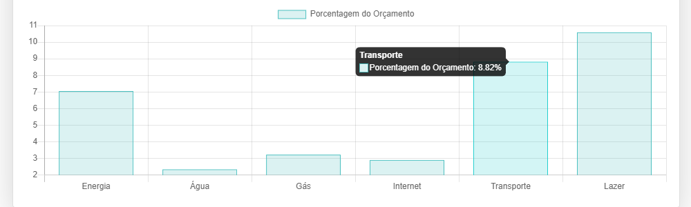
  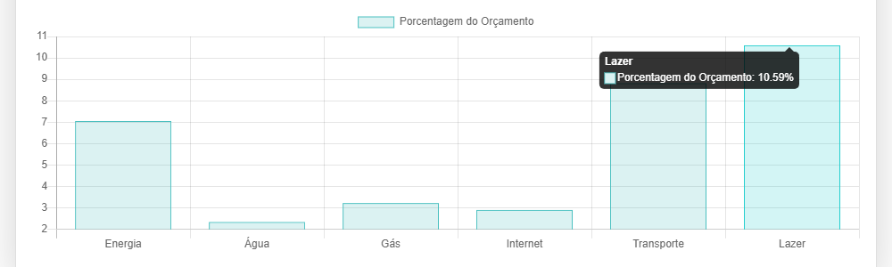

   <h3 align = "center">  Other resources </h3>
   <h4 align = "center">  Adding more debt to go over budget </h4>

 
  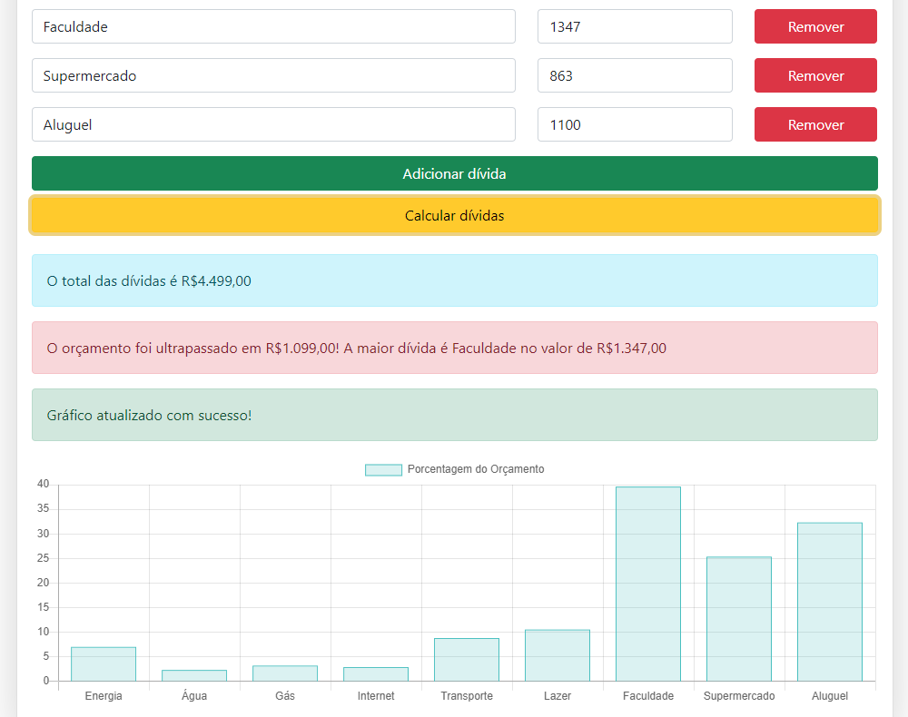

  <h4 align = "center">  Forcing errors </h4>

 
  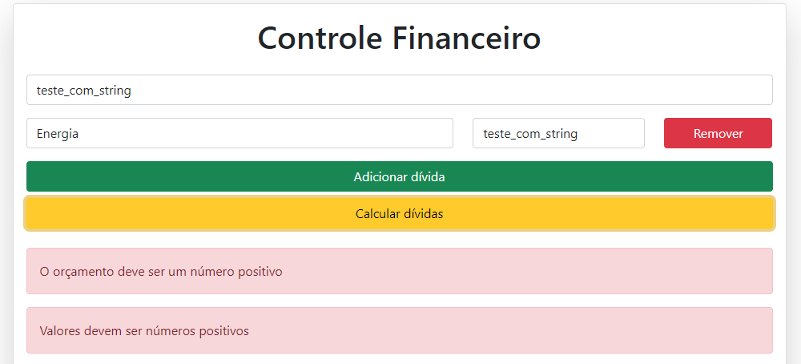

